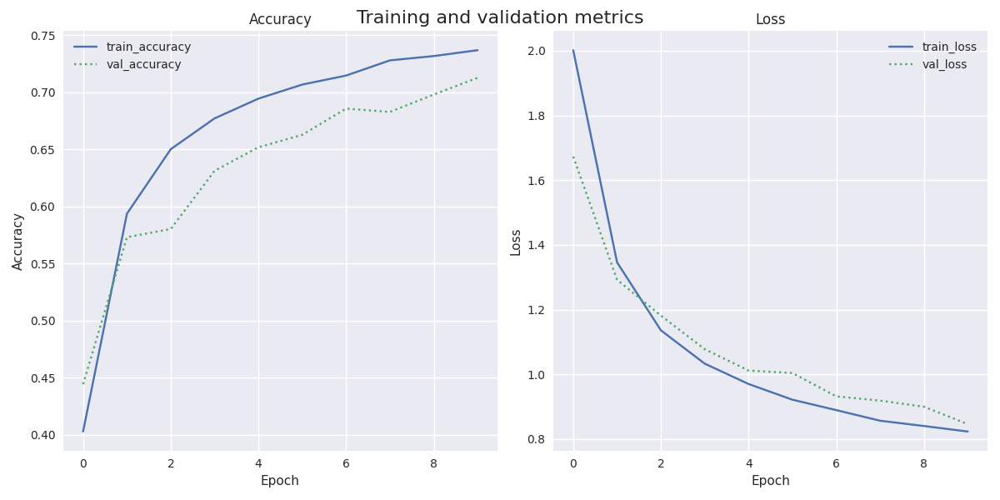

# Assignment 3 - # Using pretrained CNNs for image classification

---
# Introduction
This repository includes the code for fine-tuning a pre-trained VGG16 convolutional neural network (CNN) and performing image classification with 15 labels.

## Data
The project utilizes the Indo fashion dataset, which can be found on Kaggle at https://www.kaggle.com/datasets/validmodel/indo-fashion-dataset. The dataset comprises approximately 106,000 images that belong to 15 distinct clothing categories. The data is already divided into training, testing, and validation sets. To ensure proper functioning of the code.

## Models
The VGG16 model, sourced from https://medium.com/@mygreatlearning/everything-you-need-to-know-about-vgg16-7315defb5918, was utilized in the project. This model is composed of 16 layers and encompasses approximately 138 million parameters. It has been trained on the ImageNet dataset, providing a solid foundation for the image classification task.

## script functions
The Python script does the following with the following steps:
1. Importing the data required for the classification task and proprocessing it.
2. loading the vgg16 model
3. Training a a new classifier on top of the model consistent with the Indo Fashion dataset.
4. Saving the learning curve plots from training
5. attempting to predict labels of the test set.
6. Generating a classification report that includes evaluation metrics accuracy, precision, recall, and F1-score for the predictions. This report is both printed and saved in the out folder.
7. Also generates a confusion matrix and saves it in the out folder.

### copy the repository 
git clone https://github.com/AU-CDS/assignment3-pretrained-cnns-Olihaha
make sure to be in correct directory
(cd assignment3-pretrained-cnns)

## how to replicate 
run the setup script provided which does the following : 
1. Creates a virtual environment specifically for the project
2. Activates the venv
3. Installs the required packages from the requiremnets.txt file
4. deactivates the venv

run the run.sh file which does the following : 
1. activates the venv
2. Runs the src file.
3. Deactivates the venv

alternativly run the setupandrun.sh which does all of the above

### directory
make sure when running the code that you are in the correct repository and that the images folder is in the same folder as the script.py folder. 
The images folder has not been uploaded to github due to its sheer size and volume, but make sure it contains the following : 
test folder with 7500 images 
train folder with 91166 images
val folder with 7500 images
test_data.json
train_data.json
val_data.json

## Results
after running the code overnight to create our model we end up with the following results. If first we look at our history.png(validation and loss curve) its clear that the accuracy is starting to flatten slightly, this indicates that the model has run enough to get close to its peak efficiency, but we are nowhere near overfitting. 

### Classifier
                      precision    recall  f1-score   support
               saree       0.86      0.94      0.90       500
              blouse       0.75      0.46      0.57       500
         dhoti_pants       0.75      0.52      0.62       500
            dupattas       0.67      0.43      0.52       500
               gowns       0.68      0.76      0.72       500
           kurta_men       0.64      0.65      0.65       500
    leggings_and_salwars       0.82      0.83      0.83       500
             lehenga       0.81      0.81      0.81       500
         mojaris_men       0.82      0.82      0.82       500
       mojaris_women       0.89      0.74      0.81       500
       nehru_jackets       0.84      0.72      0.77       500
            palazzos       0.68      0.79      0.73       500
          petticoats       0.65      0.91      0.75       500
           sherwanis       0.79      0.70      0.74       500
         women_kurta       0.50      0.82      0.62       500

            accuracy                           0.73      7500
           macro avg       0.74      0.73      0.72      7500
        weighted avg       0.74      0.73      0.72      7500

On a dataset of 7500 cases, the classifier performs quite well, with an overall accuracy of 73%. 